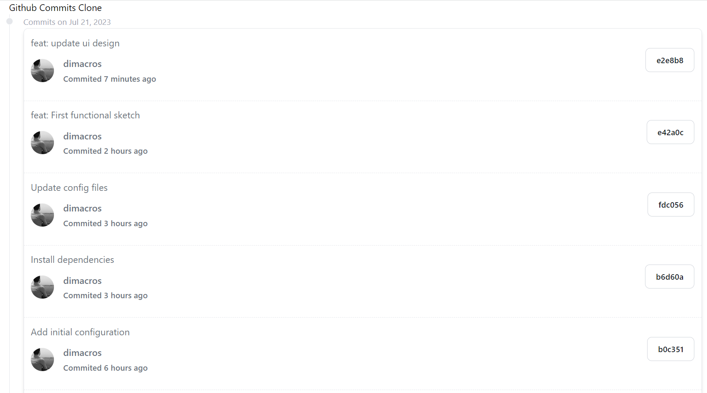

# Challenge
The goal of this test will be to create an app that shows **git commit history** on the same project you are working on. You need to do well-stated and defined commits while working on this test and regularly push them up.

You will need to sign up for a free GitHub account if you do not already have one, then create a public repository to store your work so that we will be able to see and review it. You can find documentation on the GitHub API here: https://developer.github.com/v3/.

Choose the frontend and backend technologies that best suit your skill set in order to build the solution,  Angular, Vue, or React frameworks or even Flutter, Swift or Android, if you like Mobile development. Pair them up with NodeJS, Python, or .Net, to create the perfect backbone.
Use all the technologies and skills that you want to showcase, but don't forget you must show on UI the methods that were worked on the backend.

# Getting started

## Requirements
- Nodejs v.18

## Installation

First, clone the repository:

`git clone https://github.com/dimacros/github-commits-clone`

Second, install the dependencies: 

`npm install`

Finally, start the website: 

`npm run dev`

If you want to show other results, just change the variable in `.env.local` to any repo

